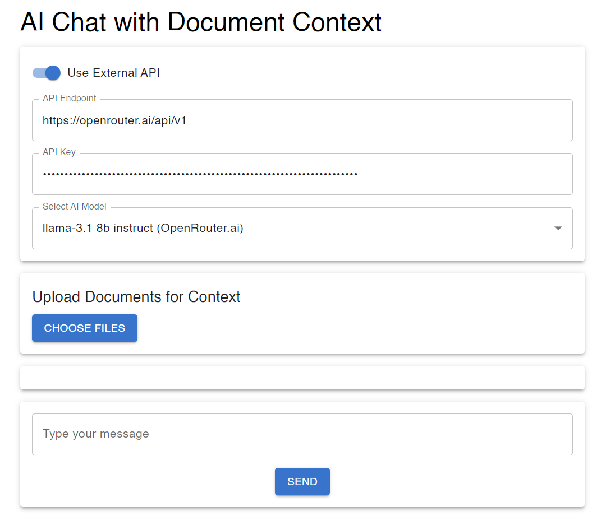

# AI Chat with Document Context

This project is an AI-powered chatbot that can process uploaded documents and use them to provide context-aware responses. The chatbot can be configured to use either a locally hosted AI model or an external AI API (like OpenRouter.ai) depending on your environment (local development or deployment).



## Features

- **Document Processing:** Upload documents in various formats (e.g., PDF, DOCX, TXT, Markdown) for the AI to use as context.
- **Local AI Model:** Utilizes a locally hosted AI model (like Llama 3.1) when running in a local development environment.
- **External AI API Integration:** Configurable to use external AI services like OpenRouter.ai when deployed or when preferred.
- **Dynamic API Endpoint:** Automatically switches between local and external AI services based on the environment.

## Getting Started

### Prerequisites

- Node.js
- npm (or yarn)
- An AI model running locally (for example, Llama) or access to an external AI API like OpenRouter.ai.
- Optional: Vercel account for deployment.

### Installation

1. Clone the repository:

   ```bash
   git clone https://github.com/yourusername/ai-chat-document-context.git
   cd ai-chat-document-context
   ```

2. Install dependencies:

   ```bash
   npm install
   ```

3. Set up environment variables:

   - Create a `.env.local` file for local development:

     ```bash
     AI_API_URL=http://127.0.0.1:11434  # Local AI model endpoint
     ```

   - For production (e.g., on Vercel), set the `AI_API_URL` environment variable to your external API endpoint in Vercel’s dashboard.

4. Run the development server:

   ```bash
   npm run dev
   ```

5. Access the application at `http://localhost:3000`.

### Deployment

To deploy the project, you can use Vercel or any other platform supporting Next.js:

1. Push your code to a GitHub repository.
2. Connect your repository to Vercel.
3. Set up environment variables in Vercel (as mentioned in the installation steps).
4. Deploy your project.

### API Configuration

- **Local Development:** Uses a locally hosted AI model. Make sure the model is running and accessible at the specified `AI_API_URL`.
- **Production:** Defaults to using an external API (e.g., OpenRouter.ai). Ensure your API endpoint and keys are correctly set.

## Usage

### Document Upload

Upload your documents via the "Upload Documents for Context" section. The bot will process these documents and use them as context for answering queries.


### Chat Interaction

Enter your queries in the chat box. The bot will generate responses based on the context provided by the uploaded documents.


### Switching Between Local and External AI

Use the toggle switch to choose between your local AI model and an external AI service. The local AI model can only be used running this project on localhost. The external AI service can be used either locally or deployed on a remote server.

The API endpoint and model can be selected in the input fields when using an external service.

## Project Structure

- **`pages/`**: Contains the main application components and API routes.
- **`components/`**: Reusable UI components like `ChatBox`, `DocumentUploader`, and `ChatHistory`.
- **`utils/`**: Utility functions for document processing, embedding generation, and more.
- **`styles/`**: Global and component-specific styles.

## License

This project is licensed under the MIT License. See the [LICENSE](LICENSE) file for details.

## Acknowledgements

- Thanks to OpenRouter.ai for providing the API integration guide.
- Special mention to the AI model creators and contributors to the AI community.
